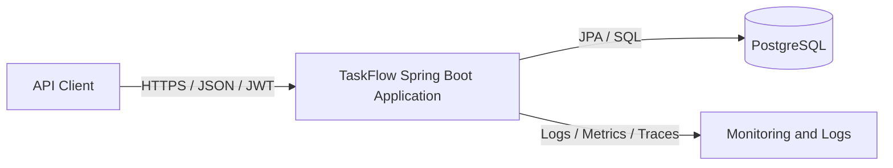
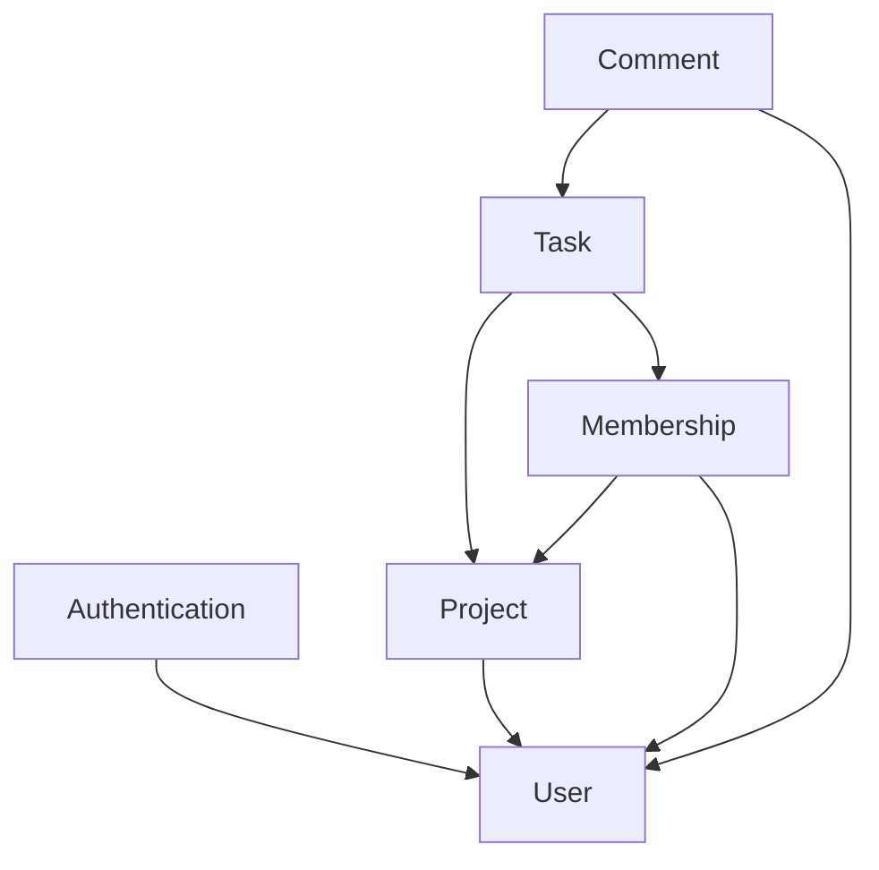
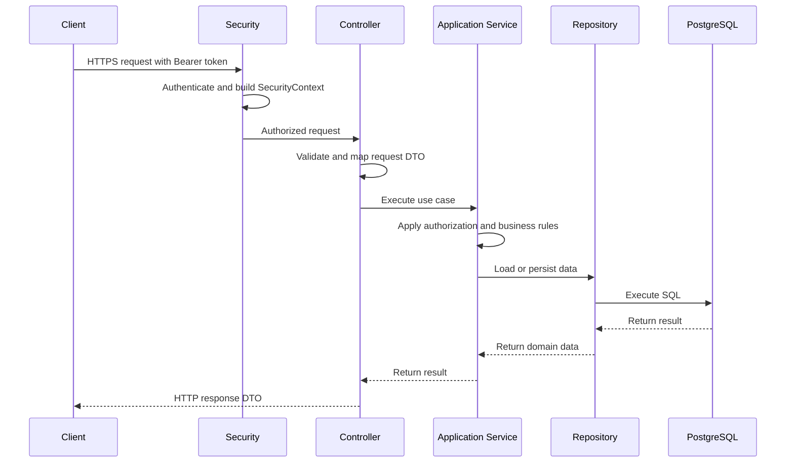
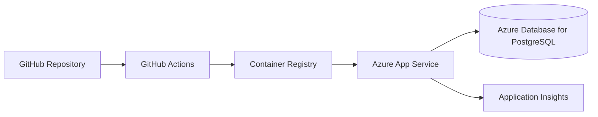

# TaskFlow Backend Architecture

## 1. Purpose

This document describes the initial architecture of the TaskFlow backend.

TaskFlow is a project and task management REST API built as a Spring Boot
application. The architecture is designed to support authentication, projects,
memberships, tasks, assignments, comments, search, persistence, testing, and
production deployment without introducing unnecessary distributed-system
complexity.

## 2. Architecture Drivers

The architecture prioritizes:

- Clear business-module boundaries.
- Secure access to project resources.
- Maintainability as the codebase grows.
- Testability at unit and integration levels.
- Transactional consistency.
- Explicit API contracts.
- Efficient PostgreSQL access.
- Simple local development and deployment.
- A future path to extract services only when justified.

## 3. Architectural Style

TaskFlow uses a Modular Monolith.

The system is deployed as one Spring Boot application and one application
database, while the codebase is divided into business-focused modules with
explicit responsibilities.

A module owns its API, application services, domain rules, and persistence
implementation. Modules must not access another module's repository or internal
entities directly.



## 4. Core Modules

### Authentication

Responsible for:

- Registration and login workflows.
- Password hashing.
- JWT creation and validation.
- Establishing the authenticated principal.

### User

Responsible for:

- User identity and profile data.
- Global roles.
- Account status.
- Administrative user operations.

### Project

Responsible for:

- Project lifecycle.
- Project ownership and management.
- Project archival rules.

### Membership

Responsible for:

- Project membership.
- Adding and removing members.
- Project-level access decisions.
- Membership status and history.

### Task

Responsible for:

- Task lifecycle.
- Status and priority.
- Due dates.
- Task assignment rules.
- Task search and filtering.

### Comment

Responsible for:

- Task comments.
- Comment authorship.
- Access to comments through project membership.

## 5. Module Relationships



The arrows represent allowed business dependencies, not direct access to
another module's database implementation.

Cross-module collaboration should use an application-facing interface, a
stable identifier, or a domain event when asynchronous behavior becomes
necessary.

## 6. Package Organization

TaskFlow uses package-by-feature rather than grouping every controller,
service, or repository into global technical packages.

```text
com.taskflow
├── auth
│   ├── api
│   ├── application
│   ├── domain
│   └── infrastructure
│       └── security
├── user
│   ├── api
│   ├── application
│   ├── domain
│   └── infrastructure
├── project
├── membership
├── task
├── comment
├── shared
│   ├── audit
│   ├── exception
│   ├── pagination
│   └── validation
└── config
```

The Authentication module owns Spring Security integration, JWT processing,
authentication filters, and authenticated-principal construction under
`auth.infrastructure.security`.

Resource-level authorization remains inside the application services of the
module that owns the protected resource. For example, project membership checks
belong to the Project or Membership use case rather than the Authentication
module.

Not every package must be created in advance. Packages are introduced when a
feature needs them.

### API

Contains:

- REST controllers.
- Request and response DTOs.
- HTTP validation.
- HTTP-to-application mapping.

### Application

Contains:

- Use-case orchestration.
- Transaction boundaries.
- Authorization coordination.
- Application-facing interfaces.

### Domain

Contains:

- Business concepts.
- Business rules and invariants.
- Domain-specific value types.
- Domain exceptions.

### Infrastructure

Contains:

- JPA entities and repositories.
- Persistence adapters.
- External service integrations.
- Framework-specific implementations.

## 7. Request Flow



Controllers must remain thin. They must not implement business rules or access
repositories directly.

## 8. API and DTO Rules

- JPA entities are never returned directly by REST controllers.
- Requests and responses use dedicated DTOs.
- Input validation occurs at the API boundary.
- Business validation also occurs inside application or domain logic.
- API responses must not expose password hashes, internal security state, or
  persistence implementation details.
- Public endpoints are versioned under `/api/v1`.
- HTTP status codes and error responses are consistent across modules.
- Mapping logic must remain explicit and testable.

## 9. Persistence Rules

- PostgreSQL is the authoritative application data store.
- UUIDs are used for externally visible aggregate identifiers.
- Database structure is managed through versioned Flyway migrations.
- Database constraints protect critical invariants in addition to application
  validation.
- Repositories belong to the module that owns the persisted data.
- Modules must not call another module's Spring Data repository directly.
- Queries returning collections must use pagination when result size can grow.
- Indexes are introduced for foreign keys, uniqueness rules, and measured
  query patterns.

## 10. JPA Loading and Query Guidelines

- Associations are lazy by default.
- Eager loading is not used as a general solution to missing data.
- Use explicit fetch joins, entity graphs, or DTO projections for use-case
  specific queries.
- Do not access lazy relationships after the transaction has ended.
- Detect and prevent N+1 queries in integration tests for important endpoints.
- Do not serialize JPA entities directly.
- Avoid loading entire collections when only counts or filtered subsets are
  required.

## 11. Transaction Boundaries

- Application services own transaction boundaries.
- Controllers do not start or manage transactions.
- Repository operations participating in one use case run in one transaction
  when atomicity is required.
- Read-only use cases should use read-only transactions where appropriate.
- External network calls should not be performed inside long database
  transactions.
- Transaction rollback behavior must be explicit for expected business
  failures.
- Optimistic locking may be used for resources that can be updated
  concurrently.

## 12. Security Boundaries

TaskFlow applies authorization at two levels:

1. Global roles define platform-level capabilities.
2. Project membership determines access to a specific project.

Security is enforced through Spring Security at the HTTP boundary and through
resource-level checks in application services.

Clients cannot grant themselves roles, project membership, task ownership, or
access by submitting identifiers in a request.

## 13. Error Handling

- Business and validation failures use explicit application exceptions.
- A global exception handler converts exceptions to stable API error responses.
- Internal stack traces are never returned to clients.
- Expected conflicts use appropriate status codes such as `409 Conflict`.
- Authentication and authorization failures use `401 Unauthorized` and
  `403 Forbidden` consistently.
- Errors include a correlation identifier when observability is introduced.

## 14. Testing Strategy

- Unit tests verify isolated business rules.
- Controller tests verify HTTP contracts and validation.
- Repository tests verify mappings and queries.
- Integration tests verify complete use cases.
- Testcontainers provides a real PostgreSQL instance for persistence tests.
- Security tests verify both global roles and project-level access.
- Important query paths are checked for excessive SQL and N+1 behavior.

## 15. Deployment View

The application is built as one executable JAR and later as one container
image.



Production credentials are supplied through the deployment environment and
must never be committed to the repository.

## 16. Evolution Guidelines

A module may become a separate service only when there is evidence that
independent deployment, scaling, ownership, or availability is required.

Before extracting a service, the team must evaluate:

- Data ownership.
- Transaction boundaries.
- API stability.
- Failure handling.
- Operational cost.
- Monitoring and deployment complexity.

The default decision is to preserve the Modular Monolith while maintaining
clear internal boundaries.

## 17. Related Documentation

- [Product Scope](product-scope.md)
- [ADR-0001: Use a Modular Monolith](adr/0001-use-modular-monolith.md)
